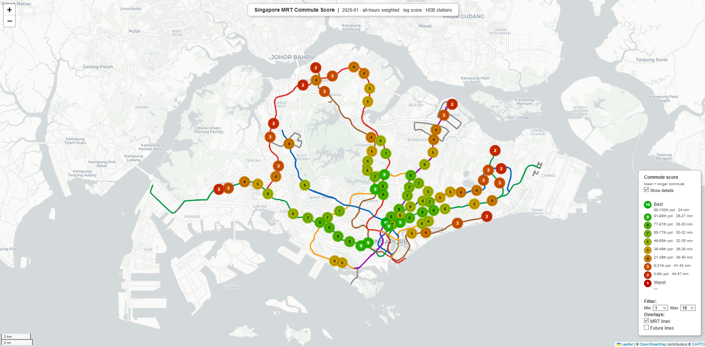
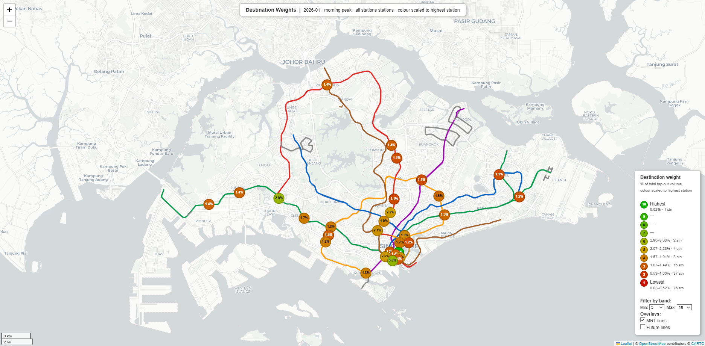

# Singapore MRT Commute Analyser

Ranks Singapore MRT stations by expected weekday commute time, using real
passenger tap-in/tap-out volumes from the LTA DataMall API to derive
data-driven destination weights.

The output is an interactive HTML map where each station is labelled with a
score on a red-to-green colour scale.

HDB estate MRTs rated on a normalized scale of 1-10:


Where do people tap out on weekday mornings?


---


**Requirements**

This project uses Poetry for dependency management.

1. Install Poetry: Run `pip install poetry`

2. Navigate to the project directory and run:

   ```
   poetry install
   ```

   This will create a virtual environment and install all dependencies.

Then run:

```
poetry run python analyse.py
```

Alternatively, activate the virtual environment with `poetry shell` and then run `python analyse.py`.

This generates `mrt_commute_scores.html` and opens it automatically in your
browser.

**Sample queries:**

```
python analyse.py --scope hdb
```
Scores only stations near HDB estates — useful if you're looking specifically
for public housing areas.

```
python analyse.py --weekday --from 7 --to 10 --weekend --from 10 --to 22 --weekend-weight-ratio 2
```
Weights destinations using weekday morning rush (7–10 am) and weekend
afternoon/evening (10 am–10 pm) tap-outs, with weekend data counting twice as
heavily as weekday — suited to a leisure-heavy lifestyle.

```
python analyse.py --score minutes --scope residential
```
Colours stations by raw expected commute minutes instead of a 1–10 scale,
making absolute differences between stations easier to read.

```
python analyse.py --score weights --weight-method morning_peak
```
Opens a separate destination-weights map showing which stations attract the
most weekday morning commuters — i.e. where people actually work.

```
python analyse.py --weights --top 15 --weekday --from 7 --to 10
```
Prints the 15 highest-weighted destination stations for the weekday morning
rush window, without opening any map.

```
python analyse.py --use-custom-weights
```
Uses manually defined destination weights from `get_weights()` in
`mrt_distance/mrt_distance.py` instead of data-driven weights. Useful for
customizing the scoring based on personal preferences or specific scenarios.

```
python analyse.py --tap in --score weights --weight-method morning_peak
```
Shows a destination-weights map based on tap-ins during the morning peak —
revealing which stations people depart from rather than arrive at, i.e. the
residential hubs commuters leave from each morning.

### Options

```
python analyse.py [--score <mode>] [--scope <scope>]
                  [--weight-method <method>] [--from <hour>] [--to <hour>]
                  [--weekday [--from <hour>] [--to <hour>]]
                  [--weekend [--from <hour>] [--to <hour>]]
                  [--weekend-weight-ratio <ratio>]
                  [--tap <direction>]
```

| Flag | Choices / type | Default | Description |
|------|---------------|---------|-------------|
| `--score` | `log`, `linear`, `minutes`, `weights` | `log` | How scores are computed and coloured |
| `--scope` | `residential`, `hdb`, `all` | `all` | Which stations appear on the map |
| `--weight-method` | `destinations`, `work_and_leisure`, `morning_peak`, `all_hours_weighted` | `destinations` | How destination weights are derived (overridden by `--weekday`/`--weekend`) |
| `--from` / `--to` | integer (0–23) | `7` / `19` | Time window for `destinations` weighting; scoped to a day type when preceded by `--weekday`/`--weekend` |
| `--weekday` | flag | — | Enable a custom weekday component; `--from`/`--to` immediately following set its window |
| `--weekend` | flag | — | Enable a custom weekend/PH component; `--from`/`--to` immediately following set its window |
| `--weekend-weight-ratio` | float | `0.4` | Weight of the weekend component relative to weekday (default 0.4 = 2/5 ratio) |
| `--tap` | `out`, `in`, `both` | `out` | Which passenger flow direction to use as destination weights |

**Score modes**

- `log` — 1–10 score using z-scores of log-transformed expected commute time.
  Amplifies differences at the short end of the distribution (recommended).
- `linear` — 1–10 score using z-scores of raw expected commute minutes.
- `minutes` — colours by raw expected commute minutes with no 1–10 scoring.
- `weights` — destination weights map (writes `mrt_destination_weights.html`
  instead of the usual commute scores map; see below).

**Scope**

Controls which stations appear on the map. The underlying commute calculation
always uses the full network as work destinations — scope only filters the
output.

- `all` — every station in the travel-time dataset  **(default)**
- `residential` — all stations near residential areas
- `hdb` — stations near HDB estates only (subset of residential)

All 9 combinations of `--score` and `--scope` are valid.

**Weight methods**

Controls how each destination station is weighted in the expected-commute
calculation. Each method produces a different view of "where people go".

- `destinations` (alias: `real_world_commuter_destinations`) — combines
  weekday tap-outs with weekend/public-holiday tap-outs in a **5:2 ratio**,
  using a configurable time window (default **07:00–18:59**).  Each component
  is normalised to 1.0 independently before combining, so the ratio reflects
  relative importance rather than raw volume.  The window is tuned to capture
  outbound trips — commuting, shopping, errands — while excluding the evening
  "going home" flow.  **(default)**

  The window can be adjusted with `--from` and `--to`:

  ```
  python analyse.py --from 7 --to 19     # default — full daytime
  python analyse.py --from 7 --to 10     # restrict to morning rush only
  python analyse.py --from 8 --to 22     # extend into the evening
  ```

- `work_and_leisure` — combines weekday **morning rush** (07:00–09:59)
  tap-outs × 5 with weekend/public-holiday **daytime** (07:00–18:59) tap-outs × 2.
  The two components are normalised to 1.0 independently before combining.
  Unlike `destinations`, the windows are fixed and are not affected by `--from` / `--to`.
  Useful for capturing a mix of commute-focused weekday flow and leisure-oriented
  weekend flow.
- `morning_peak` — uses only weekday morning (7–10 am) tap-out volumes.
  Focuses purely on work destinations; ignores weekend activity entirely.
- `all_hours_weighted` — sums tap-outs across all hours and both day types,
  weighted by the effective number of weekday and non-weekday days in the
  month.  Reflects overall station throughput including evening and mixed-use
  traffic.

**Tap direction**

Controls which side of each station's passenger flow is used to derive
destination weights.  All weight methods and custom windows are affected.

- `out` — tap-outs (passengers *arriving* at a station). Models the set of
  places people travel *to*.  This is the default and the basis for all
  commute-score analysis: busy tap-out stations are assumed to be likely
  destinations.
- `in` — tap-ins (passengers *departing* from a station). Captures where
  people start their journeys from.  Useful for understanding origin patterns
  (e.g. which stations serve as residential hubs at a given time of day).
- `both` — sum of tap-ins and tap-outs.  Reflects total passenger throughput
  regardless of direction.

```
python analyse.py --tap out     # default — arrivals at destination
python analyse.py --tap in      # departures; origin-centric view
python analyse.py --tap both    # total throughput
```

`--tap` works in all modes: commute score map, destination weights map, and
weights table.  It can be combined with any `--weight-method`,
`--weekday`/`--weekend`, or `--score` flag.

### Destination weights map

```
python analyse.py --score weights [--scope <scope>]
                  [--weight-method <method>] [--from <hour>] [--to <hour>]
```

Generates `mrt_destination_weights.html` — a standalone map showing how much
each station contributes to the commute-score centroid.

- Each circle label shows the station's **actual percentage share** of total
  network tap-out volume (e.g. `"2.3%"`).
- Colour is scaled relative to the **highest-weighted station** (= 100 on an
  internal 1–100 scale), using the same red→yellow→green gradient as the
  commute score map.  The heaviest destination always appears green; lighter
  destinations grade toward red.
- Stations are grouped into **10 bands** by relative weight (band 10 = top 10%
  of the 1–100 scale; band 1 = bottom 10%) for optional filter control.
- All `--weight-method`, `--from`, and `--to` flags apply as for the commute
  score map.
- The legend shows the actual weight% range of stations in each band.

### Inspecting destination weights

```
python analyse.py --weights [--top N] [--bottom N]
                  [--weight-method <method>] [--from <hour>] [--to <hour>]
                  [--weekday [--from <hour>] [--to <hour>]]
                  [--weekend [--from <hour>] [--to <hour>]]
                  [--weekend-weight-ratio <ratio>]
```

Prints the normalised tap-out weights that form the scoring centroid — i.e.
how much each station contributes to the "expected commute" calculation,
with a running cumulative total. `--score` and `--scope` are ignored.

| Flag | Description |
|------|-------------|
| `--weights` | Enter weights mode (print all stations, descending) |
| `--top N` | Show only the N highest-weighted stations (descending) |
| `--bottom N` | Show only the N lowest-weighted stations (ascending) |
| `--weight-method` | Which weight method to inspect (default: `destinations`) |
| `--from` / `--to` | Time window for `destinations` weighting (default: 7 / 19) |
| `--weekday` | Enable a custom weekday component; `--from`/`--to` following it set its window |
| `--weekend` | Enable a custom weekend/PH component; `--from`/`--to` following it set its window |
| `--weekend-weight-ratio` | Weight of the weekend component relative to weekday (default `0.4` = 2/5 ratio) |
| `--tap` | Passenger flow direction: `out` (default), `in`, or `both` |

`--top` and `--bottom` can be combined to print both ends in one run.
Either flag also implies `--weights`, so `--weights` itself can be omitted.
`--weekday`/`--weekend` override `--weight-method` with `custom` in both map and weights mode.

**Custom day-type windows** — `--weekday` and `--weekend` let you define the
tap-out window for each day type independently.  At least one must be given.
The `--from`/`--to` that **immediately follow** a day-type flag are scoped to
that flag's component.  These flags work in both map mode and weights mode.

```
# Map — weekday daytime only, 7 am – 7 pm
python analyse.py --weekday --from 7 --to 19

# Map — weekday morning + weekend morning (default 0.4 ratio)
python analyse.py --weekday --from 7 --to 10 --weekend --from 7 --to 12

# Map — evening emphasis, weekend twice as heavy
python analyse.py --weekday --from 9 --to 18 --weekend --from 7 --to 19 \
                  --weekend-weight-ratio 2

# Weights table — weekday only, 3 pm – 9 pm
python analyse.py --weights --weekday --from 15 --to 21

# Weights table — weekday 12 pm – 8 pm  +  weekend/PH 7 am – 10 am
python analyse.py --weights --weekday --from 12 --to 20 --weekend --from 7 --to 10

# Same windows, but weekend twice as heavy as weekday
python analyse.py --weights --weekday --from 12 --to 20 --weekend --from 7 --to 10 \
                  --weekend-weight-ratio 2
```

Each component is normalised to 1.0 independently before blending.
When `--weekday`/`--weekend` are used, `--weight-method` is overridden with `custom`.

---

## Methodology

1. **Work destination weights** — tap-out volumes from the LTA DataMall
   passenger volume dataset are aggregated per station using the selected
   weight method (default: `destinations`) and normalised to probability
   weights that sum to 1.0. Stations with higher tap-out volumes are treated
   as more likely destinations.

2. **Expected commute time** — for each residential station, the weighted
   average travel time to all work destinations is computed using a pairwise
   travel-time matrix (scraped from mrt.sg). This gives one "expected commute
   minutes" figure per station.

3. **Scoring** — stations are z-scored within the chosen scope and mapped to
   an integer 1–10 scale. The best station in the scope always scores 10 and
   the worst always scores 1.

4. **Map** — scores are rendered as coloured circles on a Folium/Leaflet map.
   Hovering a station shows its score and expected commute time.

---

## Refreshing caches

Several assets are fetched from external APIs on first run and cached locally
to avoid repeated network calls. Delete the relevant file to force a refresh
on the next run.

| Cache file | Source | When to refresh |
|------------|--------|-----------------|
| `data_cache/station_coords_cache.json` | LTA DataMall shapefile | New stations open or coordinates change |
| `data_cache/mrt_lines_cache.geojson` | OpenStreetMap (Overpass API) | MRT network map data has been updated |
| `data_cache/future_mrt_cache.geojson` | OpenStreetMap (Overpass API) | Construction/proposed lines have changed |

To delete all caches at once:

```bash
rm data_cache/station_coords_cache.json data_cache/mrt_lines_cache.geojson data_cache/future_mrt_cache.geojson
```

---

## Key files

| File | Purpose |
|------|---------|
| `analyse.py` | **Entrypoint.** Parses CLI arguments and calls `build_map()`. |
| `visualize_scores.py` | Fetches station coordinates, computes scores, and writes the HTML map. |
| `data_driven_rankings.py` | Core ranking logic: loads volumes, builds weights, computes expected commute times, and z-scores. |
| `mrt_distance/mrt_distance.py` | Reads `travel_times.csv`; defines residential and HDB station lists. |
| `mrt_volume/explore.py` | Loads and normalises the LTA passenger volume CSV. |
| `mrt_distance/travel_times.csv` | ~20 k rows of pairwise MRT travel times. |
| `mrt_volume/data/station_volumes/transport_node_train_202506.csv` | Hourly tap-in/out volumes (June 2025). |
| `data_cache/station_coords_cache.json` | Cached WGS84 station coordinates (auto-generated; delete to refresh). |
| `data_cache/mrt_lines_cache.geojson` | Cached MRT/LRT track geometries from OpenStreetMap (auto-generated; delete to refresh). |
| `data_cache/future_mrt_cache.geojson` | Cached under-construction/proposed lines from OpenStreetMap (auto-generated; delete to refresh). |
| `mrt_commute_scores.html` | Generated commute score map (not committed). |
| `mrt_destination_weights.html` | Generated destination weights map (not committed). |
